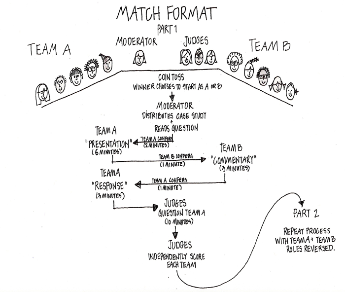

## Welcome to the Ethics Bowl!

The Ethics Bowl is a competitive yet collaborative event in which students engage in philosophical debates on real-life ethical dilemmas. It differs from a traditional debate in that the central goal of this competition is to demonstrate the breadth and depth of thinking, rather than to overwhelm or dominate the opposing team. The SCEBC is more than teaching students how to analyze ethical cases: It is to teach them how to think and discuss these issues in a civic community, where they become fellow citizens of social responsibilities. Data shows that this event teaches and promotes ethical awareness, critical thinking, civil discourse, civic engagement, and an appreciation for multiple points of view.

## Affiliation

The Sichuan Chapter of the Ethics Bowl China (SCEBC) is a regional event affiliated to the upper-level organization <a href="https://ethicsbowlchina.com">Ethics Bowl China</a>. For information on other regional events, please visit the <a href="https://ethicsbowlchina.com">EBC official website</a>.

## Location

Jiaxiang International High School, Chendu, Sichuan, China

## Date

August 13, 2020

## Event Schedule

8:00-8:30 Plenary Session  
8:45-9:50 Round 1  
10:05-11:10 Round 2  
11:25-12:30 Round 3  
12:30-13:00 Lunch  
13:10-14:15 Round 4  
14:35-14:45 Semifinalist Announced  
14:55-16:00 Semifinals  
16:10-17:15 Finals  
17:15-17:45 Trophy Presentations & Conclusion

## People

Daniel He  
Director, Sichuan Chapter of the Ethics Bowl China

Leo Huang  
Director, Ethics Bowl China, Shanghai Interscholastic Ethics Bowl

## Endorsements

The Ethics Bowl China is the officially recognized 'International Affiliate' of the US Ethics Bowl. For more information, click <a href="http://nhseb.unc.edu">here</a>.

Over 300 students registered for other regional events of the Ethics Bowl China. For information on the recent Shanghai Interscholastic Ethics Bowl, click <a href="https://sieb.ethicsbowlchina.com">here</a>.

The Ethics Bowl China is one of the initiators of the first ever International Ethics Olympiad, with students and judges from China, Australia, Canada, and the US participating online from nine different time zones and three different continents. For more information, click <a href="https://rb.gy/fv8exc">here</a>.

In the past, the Ethics Bowl China invited fellows from the University of North Carolina at Chapel Hill (where the national Ethics Bowl is hosted in the US) to our Ethics Bowl seminars! For the press release, click <a href="https://sieb.ethicsbowlchina.com/anet.html">here</a>.

## Rules

For the complete rules document, click <a href="https://ethicsbowlchina.com/resources.html">here</a>.

### How is the Ethics Bowl different from a debate?

Teams are not required to pick opposing sides, nor is the goal to “win” the argument by knocking down the other team or its position. Teams offer support for its position but also consider the merits of their opponents' positions. Changing or modifying a position is not necessarily negative.

## Sample Case

Is it O.K to punch a Nazi?

On January 20, 2017, Richard Spencer, a well-known member of the American “alt-right”, was punched in the face by an unknown assailant while he was being interviewed by an Australian journalist. The attack, which was captured on video, was almost certainly a reaction to Spencer’s vocal form of white nationalism, which includes his public support for the establishment of the U.S. as a white ethnostate. Footage of the attack soon became a popular internet meme, accompanied by the question, “Is it O.K. to punch a Nazi?” with some people comparing the masked assailant to Captain America and Indiana Jones.The punch, and the internet memes that followed it, have spawned vigorous debates about how people should respond to increasingly frequent, public displays of racism. Critics of the assault argue that violence is not the right response to political disagreement...

For the complete case set for 2020, click <a href="https://ethicsbowlchina.com/resources.html">here</a>.

## More Resources

For resources including the scoring criteria, scoresheet, video tutorials etc., please visit the <a href="https://ethicsbowlchina.com/resources.html">Ethics Bowl China Resource Page</a>.

## Something More...

### Information about this event:

Sichuan Chapter email: info1@ethicsbowlchina.com 

### More about the Ethics Bowl China:

Ethics Bowl China HQ email: info@ethicsbowlchina.com 

<a href="https://ethicsbowlchina.com">Ethics Bowl China Website</a>

### Other Ethics Bowls around the globe:

<a href="https://sieb.ethicsbowlchina.com">Shanghai Chapter</a>

<a href="http://nhseb.unc.edu">US Ethics Bowl</a>

<a href="https://www.ethicsolympiad.org">Australasia Ethics Olympiad</a>

<a href="http://millcup.wp.st-andrews.ac.uk">John Stuart Mill Cup</a>
